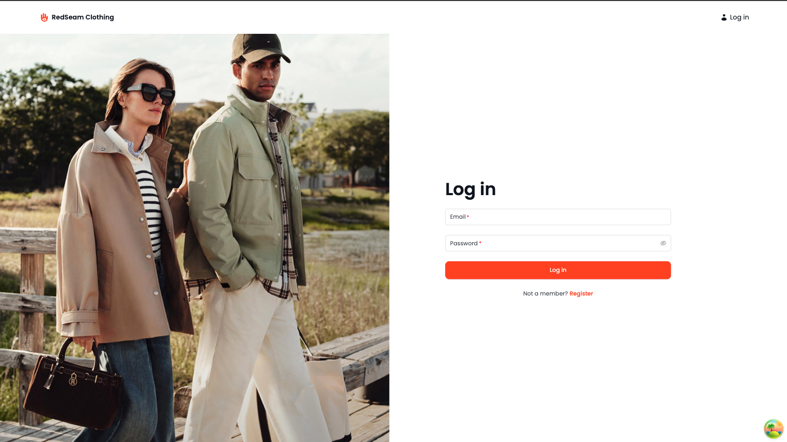
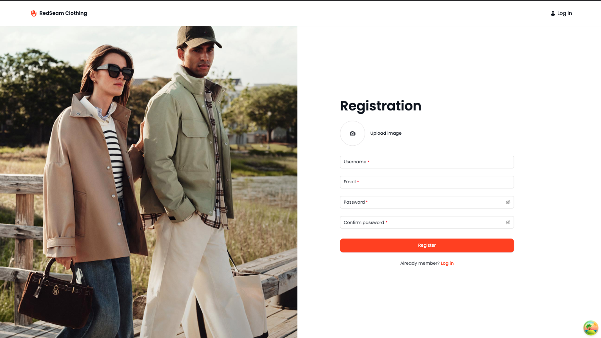
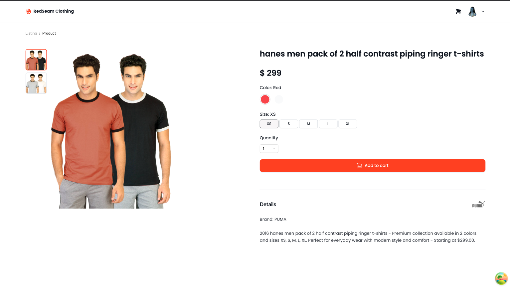
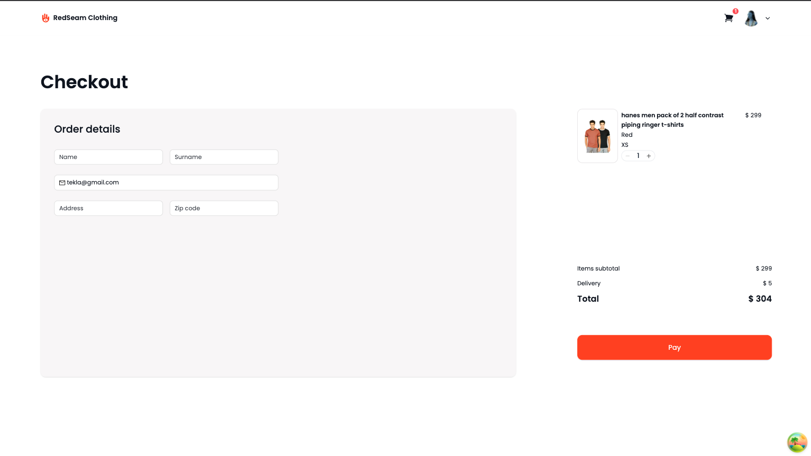

# 👗 Clothing E-Commerce Web Application


---

## 🌟 Project Overview

This is a **clothing e-commerce website** where users can browse and purchase clothing items.  
The project is built with **React**, **TailwindCSS**, and **Ant Design**, and follows the **Figma design**.

---

## 🛠 Features

- **📝 Registration & Login** – Users can create an account and log in.
- **📦 Product List Page** – Paginated product display with filtering and sorting.
- **🖼 Product Details Page** – View product image, price, color, size, and description. Add products to cart.
- **🛒 Cart Sidebar** – Shows products added to the cart in a sidebar panel.
- **💳 Checkout Page** – Users fill a form to complete the purchase.

---

## 🖼 Screenshots

### Log in



### Register



### Home / Product List


### Product Details



### Cart Sidebar


### Checkout



---

## ⚡ Technologies Used

- **React** – Frontend library
- **TailwindCSS** – Styling framework
- **Ant Design** – UI components
- **React Hook Form & Zod** – Form handling and validation
- **Axios** – HTTP requests
- **React Query** – Data fetching & caching
- **Figma** – Design reference
- **Other React tools**

---

## ⚙️ Installation

1. Clone the repository:
   ```bash
   git clone https://github.com/Omiadze/Redberry-Bootcamp---RedSeam-Clothing.git
   ```
2. Navigate to the project directory:
   ```bash
   cd Redberry-Bootcamp---RedSeam-Clothing
   ```
3. Install dependencies:
   ```bash
   npm install
   ```
4. Start the development server:
   ```bash
   npm run dev
   ```

# Live Site

Access the live application at [RedSeam](https://redseam1.netlify.app/products).

# Author

Hi, my name is Teo and I am a front-end developer.
